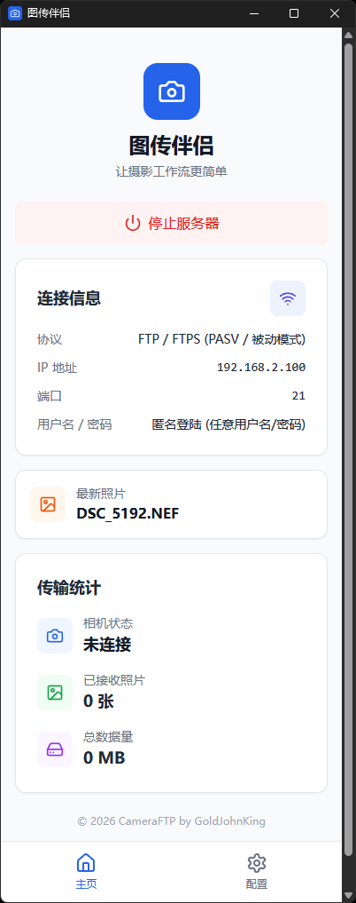
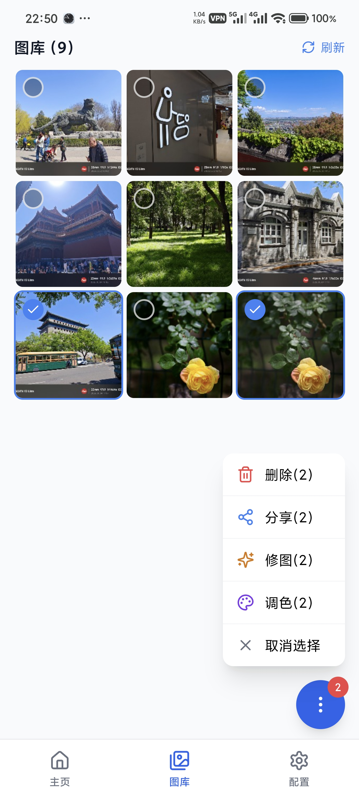
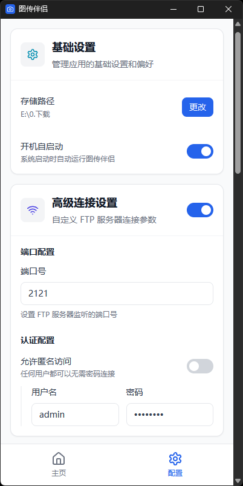
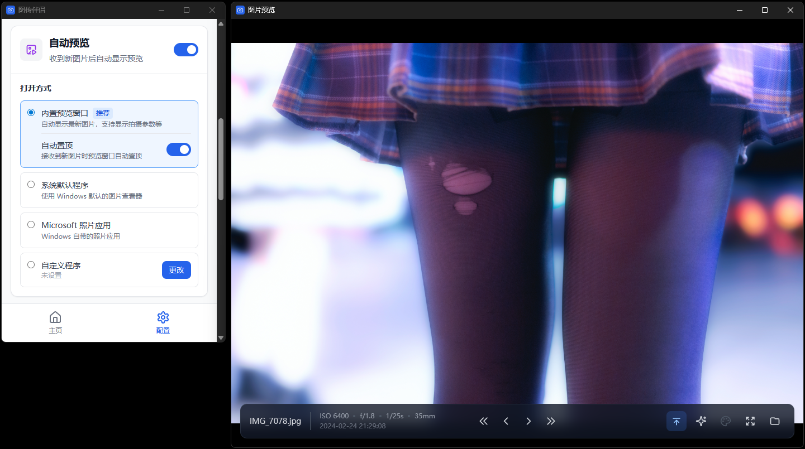

# 📸 CameraFTP（图传伴侣）

一款跨平台的相机FTP伴侣应用，让相机照片直接传输到电脑或手机。


[](https://qm.qq.com/q/IUGLEM5V28)

---

## ✨ 功能特性

- 🚀 **一键启动** - 一键启动，无需复杂配置，自动显示连接信息（IP+端口）
- 📡 **FTP服务器** - 基于FTP协议，无需蓝牙，相机WiFi直传
  - 🔐支持加密，FTP/FTPS协议自适应
  - 🔑支持自定义用户名/密码
- 📊 **实时统计** - 实时显示连接状态、最新照片、已接收照片数、数据量
- 🖼️ **自动预览** - 支持接收照片后自动打开预览窗口
- 📷 **EXIF元数据** - 预览窗口支持显示ISO/光圈/快门速度/焦距/拍摄时间
- 🎨 **多格式支持** - 支持 JPG、HEIF、RAW 等格式
- 🤖 **AI修图** - 支持火山引擎 Seedream 系列大模型，支持自动/手动AI修图
- 🎨 **RAW调色** - 支持套用多款胶片模拟调色滤镜，支持自动/手动曝光补偿，支持自动镜头校正，支持自动/批量调色

### 🖥️ Windows专属功能

- 🔔 **开机自启** - Windows后台运行，支持开机自启
- 🚦 **状态指示** - 托盘图标颜色显示服务器状态
- 🔽 **后台运行** - 支持最小化到系统托盘
- 👁️ **多种预览模式** - 内置预览 / Windows照片查看器 / 系统默认 / 自定义程序

### 📱 Android专属功能

- 🔐 **权限导览** - 缺少必要权限时，显示权限配置导览，一键直达授权界面
- 🚦 **状态指示** - 常驻通知显示服务器状态
- 🛡️ **运行保活** - 前台服务保活，WiFi锁+Wake锁，避免进程意外结束（需ROM支持）
- 🖼️ **内置图库** - 以缩略图形式显示已接收的图片，支持批量选中、删除和分享

---

## 📱 界面预览

<table>
  <tr>
    <td align="center"><b>主页 · 服务器控制与实时统计</b></td>
    <td align="center"><b>内置图库 · Android</b></td>
  </tr>
  <tr>
    <td></td>
    <td></td>
  </tr>
  <tr>
    <td align="center"><b>图片查看器 · Android</b></td>
    <td align="center"><b>基础设置 · 连接与高级配置</b></td>
  </tr>
  <tr>
    <td></td>
    <td></td>
  </tr>
  <tr>
    <td align="center"><b>自动调色 · AI修图</b></td>
    <td align="center"><b>调色 · 胶片模拟</b></td>
  </tr>
  <tr>
    <td align="center"></td>
    <td align="center"></td>
  </tr>
  <tr>
    <td align="center" colspan="2"><b>图片查看器 · Windows</b></td>
  </tr>
  <tr>
    <td align="center" colspan="2"></td>
  </tr>
</table>

---

## ⚙️ 配置与存储

### 配置文件位置

- **Windows**: `%APPDATA%\cameraftp\config.json`
- **Android**: `/data/data/com.gjk.cameraftpcompanion/files/config.json`

### 照片存储路径

- **Windows**: 用户图片目录下的 `CameraFTP` 文件夹（可配置）
- **Android**: `/storage/emulated/0/DCIM/CameraFTP`（固定路径）

---

## 🐛 常见问题

**Q: 端口被占用？**
A: 应用会自动切换到下一个可用端口。

**Q: 相机连接失败？**
A: 确保电脑和相机在同一网络，并检查防火墙设置。

**Q: Android无法保存照片？**
A: 确保已授权APP"访问全部照片和视频"。

---

## 💰 支持项目

如果这个项目对你有帮助，欢迎打赏支持开发！


---

## 📄 许可证

AGPL-3.0-or-later © 2026 GoldJohnKing <GoldJohnKing@Live.cn>

---

<details>
<summary><h2>🛠️ 开发指南</h2></summary>

### 🚀 一键编译

```bash
# 统一构建入口
./build.sh <target> [options]

# 构建目标
./build.sh windows          # Windows 可执行文件 (Release)
./build.sh android          # Android APK (Release)
./build.sh frontend         # 仅构建前端
./build.sh windows android  # 并行构建

# 其他命令
./build.sh gen-types                # 生成 TypeScript 类型绑定
./build.sh clean                    # 清理所有构建缓存
./build.sh windows android --check  # 检查编译环境

# 构建选项
--debug     # Debug 模式
--serial    # 串行构建（默认并行）
```

---

### 🏗️ 技术架构

```
    React + TypeScript + TailwindCSS (前端)
                        │
          ┌─────────────┴─────────────┐
          │                           │
          ▼                           ▼
    Tauri IPC                   JS Bridge
    (Command/Event)             (Android)
          │                           │
          ▼                           ▼
    Rust + libunftp             Kotlin
    (FTP Server)                (Android原生服务)
```

| 层级 | 技术 | 版本 |
|------|------|------|
| **框架** | Tauri v2 | ^2.0.0 |
| **前端** | React | ^18.2.0 |
| **前端语言** | TypeScript | ^5.0.2 |
| **状态管理** | Zustand | ^5.0.11 |
| **UI组件** | lucide-react | ^0.460.0 |
| **Toast通知** | sonner | ^2.0.7 |
| **样式** | TailwindCSS | ^3.4.15 |
| **构建工具** | Vite | ^5.0.0 |
| **后端语言** | Rust | Edition 2021 |
| **异步运行时** | tokio | ^1.0 |
| **FTP服务器** | libunftp | 0.23.0 |
| **FTP存储后端** | unftp-sbe-fs | 0.4.0 |
| **FTP核心** | unftp-core | 0.1.0 |
| **类型生成** | ts-rs | 10.1 |
| **EXIF读取** | nom-exif | 2.7 |
| **时间处理** | chrono | 0.4 |
| **图像处理** | image | 0.25 |
| **HEIC支持** | heic | 0.1 |
| **压缩解压** | zip | 2 |
| **DEFLATE** | flate2 | 1 |
| **字节扫描** | memchr | 2 |
| **密码哈希** | argon2 | 0.5 |
| **内存安全** | zeroize | 1.8 |
| **TLS证书** | rcgen | 0.13 |
| **动态库加载** | libloading | 0.8 |
| **并发集合** | dashmap | 6.0 |
| **错误处理** | thiserror | 2.0 |
| **日志** | tracing | 0.1 |
| **文件监听(Win)** | notify | 8.0 |
| **AI修图** | Volcengine Seedream | doubao-seedream-5-0 |
| **调色引擎** | RawAlchemyCpp | LUT + Lensfun |
| **Android Native** | Kotlin | JVM 21 |
| **Android API** | min 33 / target 36 | Android 13+ |
| **JDK** | Java | 21 |

---

### 📁 项目结构

```
cameraftp/
├── 📄 配置文件
│   ├── package.json              # Node.js依赖
│   ├── tsconfig.json             # TypeScript配置
│   ├── vite.config.ts            # Vite配置
│   ├── tailwind.config.js        # TailwindCSS配置
│   └── build.sh                  # ⭐ 统一构建入口
│
├── 📁 scripts/                   # 构建脚本
│   ├── build-common.sh           # 公共函数库
│   ├── build-windows.sh          # Windows构建
│   ├── build-android.sh          # Android构建
│   ├── build-frontend.sh         # 前端构建
│   └── build-raw-alchemy.sh      # RawAlchemyCpp动态库构建
│
├── 📁 src/                       # React前端源码
│   ├── main.tsx                  # React入口
│   ├── App.tsx                   # 主应用组件（三Tab布局）
│   ├── bootstrap/                # 应用启动逻辑
│   │   └── useAppBootstrap.ts    # 启动引导Hook
│   ├── components/               # UI组件
│   │   ├── ui/                   # 基础UI组件
│   │   │   ├── Card.tsx          # 卡片容器
│   │   │   ├── Dialog.tsx        # 对话框
│   │   │   ├── ErrorBoundary.tsx # 错误边界
│   │   │   ├── ErrorMessage.tsx  # 错误显示
│   │   │   ├── IconContainer.tsx # 图标容器
│   │   │   ├── LoadingButton.tsx # 加载按钮
│   │   │   ├── MaskedInput.tsx   # 密码输入框
│   │   │   ├── RefreshButton.tsx # 刷新按钮
│   │   │   ├── Select.tsx        # 下拉选择器
│   │   │   └── ToggleSwitch.tsx  # 开关组件
│   │   ├── ServerCard.tsx        # 服务器控制卡片
│   │   ├── InfoCard.tsx          # 连接信息卡片
│   │   ├── StatsCard.tsx         # 统计信息卡片
│   │   ├── LatestPhotoCard.tsx   # 最新照片卡片
│   │   ├── GalleryCard.tsx       # 图库组件
│   │   ├── VirtualGalleryGrid.tsx # 虚拟滚动图库
│   │   ├── ConfigCard.tsx        # 配置卡片
│   │   ├── AdvancedConnectionConfig.tsx # 高级连接配置
│   │   ├── PreviewConfigCard.tsx # 预览配置
│   │   ├── PreviewWindow.tsx     # 预览窗口
│   │   ├── PathSelector.tsx      # 路径选择器
│   │   ├── BottomNav.tsx         # 底部导航栏
│   │   ├── PermissionDialog.tsx  # 权限对话框
│   │   ├── PermissionList.tsx    # 权限列表
│   │   ├── AiEditConfigCard.tsx  # AI修图配置卡片
│   │   ├── AiEditConfigPanel.tsx # AI修图配置面板
│   │   ├── PromptDialog.tsx      # AI修图提示词对话框
│   │   ├── ColorGradingDialog.tsx # 调色对话框
│   │   ├── AutoColorGradingConfigCard.tsx # 自动调色配置
│   │   ├── ExposureConfigSection.tsx # 曝光补偿配置
│   │   ├── TaskProgressPanel.tsx # 任务进度面板
│   │   ├── AboutCard.tsx         # 关于信息
│   │   └── WeChatDonateDialog.tsx # 赞赏对话框
│   ├── hooks/                    # React Hooks
│   │   ├── usePlatform.ts        # 平台检测
│   │   ├── usePortCheck.ts       # 端口检查
│   │   ├── useLatestPhoto.ts     # 最新照片
│   │   ├── useGalleryPager.ts    # 图库分页
│   │   ├── useGallerySelection.ts # 图库多选
│   │   ├── useThumbnailScheduler.ts # 缩略图调度
│   │   ├── useImagePreviewOpener.ts # 图片预览
│   │   ├── useAiEditProgress.ts  # AI修图进度
│   │   ├── useColorGradingPresets.ts # 调色预设
│   │   ├── useColorGradingProgress.ts # 调色进度
│   │   ├── createTaskProgressHook.ts # 通用任务进度Hook工厂
│   │   ├── useAndroidAutoOpenLatestPhoto.ts # Android自动打开
│   │   ├── usePreviewWindowLifecycle.ts # 预览窗口生命周期
│   │   ├── usePreviewZoomPan.ts  # 预览缩放平移
│   │   ├── usePreviewNavigation.ts # 预览导航
│   │   ├── usePreviewToolbarAutoHide.ts # 工具栏自动隐藏
│   │   ├── usePreviewExif.ts     # 预览EXIF数据
│   │   ├── usePreviewConfigListener.ts # 预览配置监听
│   │   ├── preview-window-events.ts # 预览窗口事件常量
│   │   └── useQuitFlow.ts       # 退出流程
│   ├── services/                 # 业务逻辑服务
│   │   ├── server-events.ts      # 服务器事件处理
│   │   ├── gallery-media-v2.ts   # 图库媒体服务V2
│   │   ├── latest-photo.ts       # 最新照片服务
│   │   └── image-open.ts         # 图片打开服务
│   ├── stores/                   # Zustand状态管理
│   │   ├── serverStore.ts        # 服务器状态
│   │   ├── configStore.ts        # 配置状态（防抖自动保存）
│   │   └── permissionStore.ts    # 权限状态（Android）
│   ├── types/                    # TypeScript类型定义
│   │   ├── index.ts              # 类型导出（ts-rs生成）
│   │   ├── gallery-v2.ts         # 图库类型
│   │   ├── events.ts             # 事件类型
│   │   └── global.ts             # 全局类型声明
│   ├── constants/                # 常量定义
│   │   ├── seedream-models.ts    # Seedream可用模型列表
│   │   └── color-grading.ts      # 调色相关常量
│   └── utils/                    # 工具函数
│       ├── events.ts             # 事件管理器
│       ├── format.ts             # 格式化工具
│       ├── error.ts              # 错误处理
│       ├── gallery-refresh.ts    # 图库刷新
│       ├── gallery-delete.ts     # 图库删除
│       ├── raw.ts                # RAW文件工具
│       ├── external-link.ts      # 外部链接打开
│       └── store.ts              # 异步Store辅助
│
├── 📁 src-tauri/                 # Rust后端源码
│   ├── Cargo.toml                # Rust依赖
│   ├── build.rs                  # 构建脚本
│   ├── src/
│   │   ├── main.rs               # 程序入口
│   │   ├── lib.rs                # 库入口 & Tauri命令注册
│   │   ├── commands/             # Tauri命令（IPC接口）
│   │   │   ├── mod.rs            # 命令模块入口
│   │   │   ├── server.rs         # 服务器控制命令
│   │   │   ├── config.rs         # 配置管理命令
│   │   │   ├── storage.rs        # 存储/权限/自启命令
│   │   │   ├── file_index.rs     # 文件索引命令
│   │   │   ├── exif.rs           # EXIF读取命令
│   │   │   ├── ai_edit.rs        # AI修图命令
│   │   │   └── color_grading.rs  # 调色命令
│   │   ├── ftp/                  # FTP服务器实现
│   │   │   ├── server.rs         # FtpServerActor（生命周期管理）
│   │   │   ├── server_factory.rs # 启动流水线
│   │   │   ├── events.rs         # EventBus + 事件处理器
│   │   │   ├── listeners.rs      # FTP数据/连接事件监听
│   │   │   ├── stats.rs          # StatsActor（统计聚合）
│   │   │   ├── types.rs          # 类型定义
│   │   │   └── android_mediastore/ # Android MediaStore后端
│   │   │       ├── backend.rs    # StorageBackend实现
│   │   │       ├── bridge.rs     # JNI桥接
│   │   │       ├── types.rs      # 数据类型
│   │   │       ├── retry.rs      # 重试逻辑
│   │   │       └── limiter.rs    # 并发限制
│   │   ├── ai_edit/              # AI修图服务
│   │   │   ├── mod.rs            # 模块入口
│   │   │   ├── config.rs         # AI修图配置
│   │   │   ├── service.rs        # 双优先级队列服务
│   │   │   ├── progress.rs       # 进度事件
│   │   │   ├── providers/        # AI服务提供商
│   │   │   │   ├── mod.rs        # 提供商接口
│   │   │   │   └── seededit.rs   # 火山引擎SeedEdit
│   │   │   └── image_processor/  # 图片预处理
│   │   │       ├── mod.rs        # 平台分发
│   │   │       ├── rust_processor.rs  # Windows（image+heic）
│   │   │       └── android_processor.rs # Android（JNI）
│   │   ├── color_grading/        # 调色服务（RawAlchemyCpp FFI）
│   │   │   ├── mod.rs            # 模块入口
│   │   │   ├── service.rs        # 调色队列服务
│   │   │   ├── presets.rs        # 预设管理
│   │   │   ├── progress.rs       # 进度事件
│   │   │   ├── resources.rs      # 资源提取
│   │   │   ├── ffi.rs            # RawAlchemyCpp FFI绑定
│   │   │   ├── lut_data.rs       # LUT数据加载
│   │   │   ├── lensfun_db.rs     # Lensfun镜头数据库
│   │   │   ├── output.rs         # 输出处理
│   │   │   ├── preview.rs        # 实时预览会话
│   │   │   └── jni_bridge.rs     # Android JNI桥接
│   │   ├── image_preview/        # 图片预览缓存（Windows）
│   │   │   ├── mod.rs            # 预览缓存服务
│   │   │   └── extract.rs        # RAW内嵌JPEG预览提取
│   │   ├── file_index/           # 文件索引服务
│   │   │   ├── service.rs        # 索引服务（EXIF排序）
│   │   │   ├── types.rs          # 索引类型
│   │   │   └── watcher.rs        # 文件监听（Windows）
│   │   ├── auto_open/            # 自动预览服务
│   │   │   ├── service.rs        # 预览路由
│   │   │   └── windows.rs        # Windows预览实现
│   │   ├── platform/             # 平台适配层
│   │   │   ├── traits.rs         # PlatformService接口
│   │   │   ├── types.rs          # 平台类型
│   │   │   ├── windows.rs        # Windows实现（托盘/自启）
│   │   │   └── android.rs        # Android实现（JNI/权限）
│   │   ├── crypto/               # 加密模块
│   │   │   └── tls.rs            # TLS证书生成/轮换
│   │   ├── utils/                # 工具模块
│   │   │   ├── fs.rs             # 文件系统工具
│   │   │   └── batch_state.rs    # 批量任务进度追踪
│   │   ├── config.rs             # 配置类型定义
│   │   ├── config_service.rs     # 配置服务
│   │   ├── crypto.rs             # Argon2id密码哈希
│   │   ├── network.rs            # 网络接口检测
│   │   ├── constants.rs          # 应用常量
│   │   ├── error.rs              # 错误处理
│   │   └── image_utils.rs        # 图片工具函数
│   │
│   └── 📁 gen/android/           # Android原生代码 (Kotlin)
│       └── app/src/main/java/com/gjk/cameraftpcompanion/
│           ├── MainActivity.kt                    # 主活动，WebView管理和Bridge注册
│           ├── FtpForegroundService.kt            # 前台服务，WiFi锁+Wake锁
│           ├── PermissionBridge.kt                # 权限管理Bridge
│           ├── ImageViewerActivity.kt             # 全屏图片查看Activity
│           ├── ImageViewerAdapter.kt              # 图片查看适配器
│           ├── AndroidServiceStateCoordinator.kt  # 服务状态协调（Rust↔Android）
│           ├── UiUtils.kt                          # UI工具类
│           ├── ColorGradingActivity.kt             # 调色原生Activity
│           ├── bridges/                           # JS Bridge目录
│           │   ├── BaseJsBridge.kt                # Bridge基类
│           │   ├── GalleryBridge.kt               # 原始图库Bridge
│           │   ├── GalleryBridgeV2.kt             # 增强图库Bridge（分页+缓存）
│           │   ├── ImageViewerBridge.kt           # 图片查看Bridge
│           │   ├── MediaStoreBridge.kt            # MediaStore集成Bridge
│           │   ├── ImageProcessorBridge.kt        # 图片预处理Bridge（JNI调用）
│           │   └── ColorGradingJniBridge.kt       # 调色JNI Bridge
│           ├── controllers/                        # 控制器目录
│           │   ├── ExifController.kt               # EXIF数据控制器
│           │   ├── WebViewOverlayController.kt     # WebView叠加控制器
│           │   ├── TaskProgressController.kt       # 任务进度控制器
│           │   └── DeleteController.kt             # 删除操作控制器
│           └── galleryv2/                         # Gallery V2实现
│               ├── MediaPageProvider.kt           # 分页媒体加载
│               ├── ThumbnailCacheV2.kt            # 缩略图缓存（内存+磁盘）
│               ├── ThumbnailDecoder.kt            # 缩略图解码
│               ├── ThumbnailKeyV2.kt              # 缓存键
│               └── ThumbnailPipelineManager.kt    # 缩略图管道管理
│
└── 📁 dist/                      # 构建输出

---

### 🤖 Android 原生代码

Android平台使用Kotlin实现以下功能：

| 文件 | 功能 |
|------|------|
| **MainActivity.kt** | 主活动，WebView管理和所有Bridge注册 |
| **FtpForegroundService.kt** | 前台服务，WiFi锁+Wake锁，状态通知 |
| **PermissionBridge.kt** | 权限管理（存储、通知、电池优化） |
| **ImageViewerActivity.kt** | 全屏图片查看（ViewPager2 + 捏合缩放 + EXIF叠加） |
| **ImageViewerAdapter.kt** | 图片查看适配器 |
| **AndroidServiceStateCoordinator.kt** | 服务状态协调（Rust↔Android JNI同步） |
| **UiUtils.kt** | UI工具类 |
| **ColorGradingActivity.kt** | 调色原生Activity，JNI调用RAW处理 |
| **bridges/GalleryBridge.kt** | 原始图库Bridge |
| **bridges/GalleryBridgeV2.kt** | 增强图库Bridge，支持分页加载和缩略图缓存 |
| **bridges/ImageViewerBridge.kt** | 图片查看Bridge，支持全屏查看和EXIF回调 |
| **bridges/MediaStoreBridge.kt** | MediaStore集成Bridge，供Kotlin/Rust集成调用 |
| **bridges/ImageProcessorBridge.kt** | 图片预处理Bridge（JNI调用），解码+降采样+Base64编码 |
| **bridges/ColorGradingJniBridge.kt** | 调色JNI Bridge，调用RawAlchemyCpp C API |
| **galleryv2/MediaPageProvider.kt** | 分页媒体加载 |
| **galleryv2/ThumbnailCacheV2.kt** | 缩略图缓存，内存+磁盘两级 |
| **galleryv2/ThumbnailDecoder.kt** | 缩略图解码 |
| **galleryv2/ThumbnailKeyV2.kt** | 缓存键 |
| **galleryv2/ThumbnailPipelineManager.kt** | 缩略图管道管理 |

#### Controllers

| 文件 | 功能 |
|------|------|
| **controllers/ExifController.kt** | EXIF数据预加载控制器 |
| **controllers/WebViewOverlayController.kt** | WebView叠加层控制器 |
| **controllers/TaskProgressController.kt** | 任务进度控制器 |
| **controllers/DeleteController.kt** | 删除操作控制器 |

#### JS Bridge 说明

前端通过以下Bridge与Android原生交互：

```typescript
// 权限管理
window.PermissionAndroid?.checkAll()
window.PermissionAndroid?.requestStorage()
window.PermissionAndroid?.requestNotification()
window.PermissionAndroid?.requestBatteryOptimization()

// 图库访问（V2增强版，支持分页和缓存）
window.GalleryAndroidV2?.listMediaPage(requestJson)
window.GalleryAndroidV2?.enqueueThumbnails(requestsJson)
window.GalleryAndroidV2?.registerThumbnailListener(viewId, listenerId)
window.GalleryAndroidV2?.cancelThumbnailRequests(idsJson)

// 图片查看
window.ImageViewerAndroid?.openOrNavigateTo(uri, allUrisJson)
```

</details>
